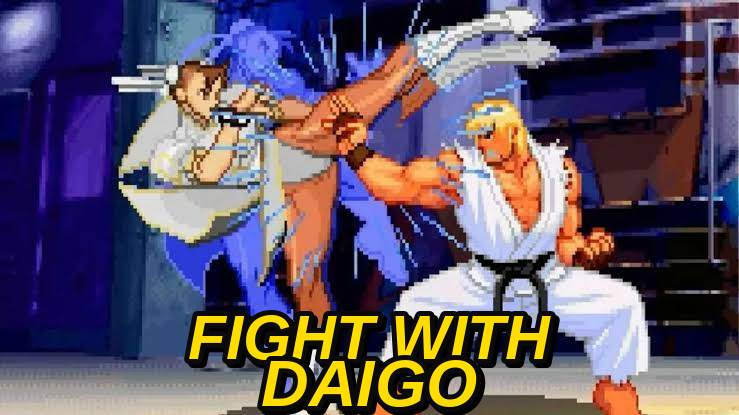

# Fight with Daigo



Remember [Evo Moment 37](https://en.wikipedia.org/wiki/Evo_Moment_37) — the
most famous parry in fighting game history? This is a Lua mod for **Street
Fighter III: 3rd Strike** that puts an AI-controlled Ken in your corner,
built to fight with that same philosophy: it reads your patterns, punishes
your whiffs, blocks everything you throw at it, and every so often, mid-hit,
goes for the parry. Not another generic hard CPU — a rule-based bot built by
reading the game's memory live, made specifically to fight like Daigo
Umehara.

See [CHANGELOG.md](CHANGELOG.md) for what's changed recently.

## How to install & run

1. **Get the ROM.** You need a legitimate `sfiii3nr1` (Japan 990512) ROM
   yourself — it is not included or distributed in this repo. Place it
   where Fightcade expects its FBNeo ROMs.
2. **Download this repo.** Either `git clone` it or download the ZIP from
   GitHub and extract it anywhere on disk — the folder location doesn't
   matter, `main.lua` locates its sibling files by its own path.
3. **Launch Fightcade** and start the game (`Street Fighter III: 3rd
   Strike - sfiii3nr1`) in a **2-player / Free Play** match. This mod
   drives P2 like a bot standing in for a second human — you play P1, and
   don't need to touch P2's controls at all (character select included).
4. **Load the script**: `Game -> Lua Scripting -> New Lua Script Window`,
   then `Browse...` and pick `src/main.lua` from where you downloaded this
   repo, and `Run`.
5. **Play.** P2 auto-joins, auto-selects Ken (white gi) and his Super Art,
   and the AI takes over from there for the whole match — no further input
   needed on P2's side.

**Running Fightcade as a Flatpak on Linux?** Its sandbox can't see your
real filesystem by default, so the file browser may show your project
folder as empty. Either copy `src/` into a location the sandbox already
has access to (its own data directory under `~/.var/app/com.fightcade.Fightcade/`),
or grant it access to your project folder specifically and restart
Fightcade completely for it to take effect:
```
flatpak override --user --filesystem="/path/to/fight-with-daigo" com.fightcade.Fightcade
```

## About the mod

A Lua script that, in two-player mode, controls P2 as Ken (white gi) via a
rule-based bot that reads the game state from RAM and decides inputs frame
by frame. It's not a machine-learning-trained model.

**About the name and the current state — being honest about it:** the base
is a bot built on generic fighting-game fundamentals (anti-air, blocking,
throw tech, footsies) — not a model trained on real data about how Daigo
plays. On top of that we did actual research (interviews, his book, FGC
scene analysis) looking for documented tendencies of his, not generic ones.
Result:

- Verified with a direct citation: [Evo Moment 37](https://en.wikipedia.org/wiki/Evo_Moment_37)
  (he played Ken, parried Chun-Li's Super Art, finished with SA3/Shippu
  Jinraikyaku in that specific match — there's no source saying that's his
  default pick in general).
- Verified with direct citations: he plays prioritizing reads and
  whiff-punishing over reacting on reflex ([EventHubs, 2023](https://www.eventhubs.com/news/2023/may/14/daigo-umehara-analyzes-wins-sf6/)),
  profiles the opponent within the first seconds of a match ([EventHubs, 2018](https://www.eventhubs.com/news/2018/may/01/chris-tatarian-sits-down-daigo-umehara-discuss-short-sets-dealing-pressure-ume-shoryu-and-more/)),
  and the "Ume-Shoryu" (throwing out a reversal as a calculated gamble, not
  a guaranteed reflex) is a named phenomenon in the FGC scene, same source.
- No source found: which normal he prefers in footsies, button preference
  for anti-airs, or a "default" SA for Ken outside of Evo Moment 37.

With that in mind, `anti_air.lua` and `block.lua` now have a random delay
before reacting (instead of always reacting on the exact frame), as a first
step toward "read and decide" instead of "fixed trigger" — still far from
actually modeling reads/opponent profiling, which remains a TODO.

## Project status

Functional as a prototype. P2 auto-selects itself (Ken, white gi, SA3)
without touching the controller. During the match:

- Reactive anti-air: shoryuken (random LP/MP/HP, EX if there's meter) 75%
  of the time, a normal anti-air (st.HP) the rest — so it's not 100%
  predictable or always air-parryable — with cooldown and a near-instant
  reaction delay.
- Melee blocking (based on a real attack hitbox, not distance, crouching
  only for lows) and standing blocking against hadoukens (reads the
  projectile list), with a parry attempt before blocking — 50% against
  projectiles, 40% against melee hits (the nod to Evo Moment 37), Block as
  a fallback either way. Neither is unconditional: a parry attempt itself
  briefly drops the block (has to, they're opposite inputs), so both roll
  a chance instead of always taking that guard-drop risk.
  Partially addressed for repeat offenders: the first time it sees any
  given move it's still purely reactive (no lead time — a fast enough
  "close" normal can still connect before the block registers, especially
  point-blank), but it times how long that exact move took to become
  active and remembers it per character; the next time it sees the same
  move, it starts blocking a couple of frames before the hitbox goes live
  instead of waiting for it. See `opponent_move_timing.lua`.
- Throw tech at grab range, alternating between a neutral throw and a back
  throw (crosses the opponent to the other side).
- **Wake-up mixup**: on a knockdown, alternates between a throw attempt and
  a meaty poke instead of always standing there mashing the same grab
  input. The throw attempt itself is a short bounded burst, not a mash for
  the whole knockdown window — live-tested and reported as an obvious tell
  that let a reversal shoryuken always beat it.
- **Whiff punish**: punishes the opponent the instant they enter recovery,
  with a combo (cr.MK canceled into Super Art if there's meter, or into
  shoryuken if not) instead of a single hit — the only rule based on real
  research about Daigo (see above), not on generic fundamentals. The
  cancel timing (`combo_punish.lua`) still isn't confirmed live — we don't
  know for sure whether it connects as a real combo or as two separate
  hits.
- Footsies: closes the distance (walking, dashing, tatsumaki, offensive
  jump, or holding ground at random — not always a straight line forward,
  and discounted from repeating the same one twice in a row) and pokes
  (random cr.MK / cr.MP / st.MP) when the opponent enters range, with an
  occasional step back after poking. EX tatsumaki is rare (10%) rather than
  routine — it spends the same meter Whiff Punish needs for a Super Art
  punish, so burning it just to close distance was reported as costing the
  bigger payoff.
- **Easter egg**: if the opponent is Chun-Li and picked SA2 (Houyoku Sen)
  at character select, the melee parry attempt chance goes to 100% instead
  of 18% — the Evo Moment 37 recreation. Doesn't fingerprint the specific
  move by its `action_state` id (a candidate we found in the framedata
  turned out not to match how that field actually reads at runtime); since
  a character can only have one Super Art per match, knowing she picked
  SA2 is enough.

- **Reads**: tracks a couple of live tendencies for the whole session (not
  just the current round), and counters them harder the more they show up
  — jumping in close a lot pushes anti-air toward near-certain, near-instant
  shoryuken; throwing a lot of projectiles pushes footsies to close the
  distance (dash/tatsumaki) instead of walking or backing off. Not a
  game-tree/minimax search — that needs simulating the opponent's future
  moves, which isn't possible live against an unknown human — closer to a
  human player noticing a habit after a few repeats and leaning on it.
  Predictive blocking (see above) uses the same "learn it live" approach:
  no external framedata, just remembering what it's already measured
  against this opponent this session.

TODO: more research into real sources about Daigo to replace the generic
parameters that remain.

## Requirements

- Fightcade v2.0.91 (or a client running the same FBNeo build)
- A legitimate `sfiii3nr1` (Japan 990512) ROM — **not distributed here, get
  your own**
- Lua Scripting enabled in the emulator

## Structure

```
src/
  main.lua           -- entry point, loads everything else and runs the main loop
  memory.lua         -- memory addresses and player state reading
  projectiles.lua    -- reads the list of active projectiles
  character_select.lua -- forces P2 = Ken (white gi, SA3)
  opponent_tracker.lua -- remembers P1's picked Super Art (Evo Moment 37 easter egg)
  ai/
    decide.lua       -- orchestrator: priority between the rules below
    util.lua          -- shared helpers (jump posture, directions)
    anti_air.lua      -- reactive shoryuken
    block.lua         -- melee blocking (real hitbox) and projectiles
    parry_fireball.lua -- parry attempt before Block blocks a projectile
    parry_melee.lua   -- occasional melee parry attempt (Evo Moment 37)
    throw_tech.lua    -- throw tech
    wakeup_mixup.lua  -- throw vs. meaty poke mixup on knockdown
    super_art.lua     -- Super Art 3 (Shippu Jinraikyaku), used by combo_punish
    combo_punish.lua  -- cr.MK canceled into special/Super Art, used by whiff_punish
    whiff_punish.lua  -- punishes the opponent on recovery
    tatsumaki.lua     -- hurricane kick, used to close distance
    dash.lua          -- forward dash, used to close distance
    jump_in.lua       -- offensive jump, used to close distance
    footsies.lua      -- walk/poke at mid range, orchestrates the approach
```

## Credits

The research into several of the memory addresses used here took as
reference the public work of [Grouflon/3rd_training_lua](https://github.com/Grouflon/3rd_training_lua).
The code in this repo is an original implementation, not a copy.

## Legal notice

This project does not include or distribute ROMs or protected game assets.
It's a third-party mod/tool for personal use with a legitimate copy of the
game.
